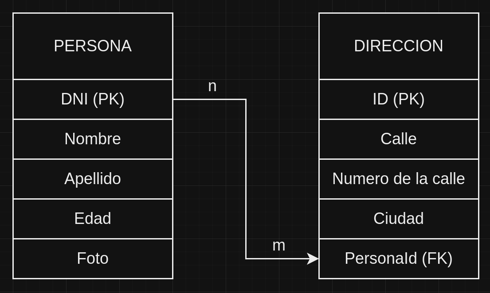

# PRUEBA TÉCNICA NODE
## Problema

Implementar una API Rest que permita guardar y listar varias personas con sus respectivas
direcciones con las siguientes características:
- PERSONA
  - A ) DNI (ID)
  - B) Nombre
  - C) Apellido
  - D) Edad
  - E) Foto

- DIRECCIÓN
  - F) ID
  - G) Calle
  - H) Número de calle
  - I) Ciudad

Una persona puede tener 1 o varias direcciones.

## A implementar:
1) Listado de personas con sus correspondientes direcciones: METHOD GET (Respetar
convenciones en la url)
2) Listado filtrado por A B y D: METHOD GET (Utilizar query parameters y respetar
convenciones)
3) Alta de persona: METHOD POST (Respetar convenciones en la url). Que reciba la foto
también.
4) Modificación de persona: METHOD PUT (Respetar convenciones en la url).
5) Eliminación de persona: METHOD DELETE (Respetar convenciones en la url).
6) Obtener un persona por ID
7) Exportar listado de personas a un archivo csv

## Consideraciones:
1) Cada endpoint debe tener su test unitario
2) Proveer algún tipo de documentación que permita probar los endpoints - ej colección de Postman o Swagger
3) Manejo de excepciones
4) Retornar mensaje y código acorde a la respuesta - ej 404 cuando el recurso no se encontró, 201 cuando un recurso es creado satisfactoriamente

## Consideración opcional:
5) Presentar la solución desplegada en un ambiente serverless

Utilizar DB a libre elección

# DB Seleccionada
- Se eligio una base de datos relacional (SQL) ya que considero que es lo optimo en este caso de datos que voy a recibir. 

- La misma consta de dos tablas, PERSONA y DIRECCION, como se refirio en la consigna.

- Estas tablas se formarian de la siguiente forma: 

<p align="left">
  
</p>

- Como podemos ver en la imagen anterior, vemos que ambas tablas tienen los datos solicitados. Se presenta una relacion de uno a muchos, ya que se nos comenta que una persona puede tener varias direcciones, por lo que se crea una clave foranea (PersonaId) en la tabla DIRECCION para poder hacer posible esta relacion de uno a muchos.
- Con lo anterior mencionado, la informacion de la tabla queda de la siguiente manera: 
  - PERSONA
    - DNI: Entero, clave primaria (PK), no nulo, entre 7 u 8 caracteres.
    - Nombre: Cadena de caracteres, no nulo.
    - Apellido: Cadena de caracteres, no nulo.
    - Edad: Entero, no nulo, entre 1 y 120.
    - Foto: Cadena de caracteres (URL o ruta de la imagen).

  - DIRECCION:
    - ID: Entero, clave primaria (PK), no nulo.
    - Calle: Cadena de caracteres, no nulo.
    - Número de calle: Entero, no nulo.
    - Ciudad: Cadena de caracteres, no nulo.
    - PersonaId: Entero, clave foránea (FK) que referencia a la tabla Personas, no nulo, entre 7 u 8 caracteres.

# Endpoints
- A continuacion se van a detallar los diferentes endpoints, su funcionalidad y sus respuestas esperadas.
  1) Listado de personas con sus correspondientes direcciones: METHOD GET (Respetarconvenciones en la url)
    - Descripcion: "Devuelve un listado de todas las personas con sus correspondientes direcciones"
    - Metodo: GET
    - URL: '/api/personas'
    - Ejemplo de respuesta:
      ```json
      [
        {
          "DNI": 12345678,
          "Nombre": "Juan",
          "Apellido": "Pérez",
          "Edad": 30,
          "Foto": "https://example.com/fotos/juan.png",
          "Direcciones": [
            {
              "ID": 1,
              "Calle": "Av. Siempre Viva",
              "Numero": 742,
              "Ciudad": "Springfield"
            }
          ]
        },
        {
          "DNI": 12345679,
          "Nombre": "Alejandra",
          "Apellido": "Garcia",
          "Edad": 60,
          "Foto": "https://example.com/fotos/Alejandra.png",
          "Direcciones": [
            {
              "ID": 2,
              "Calle": "Av. Alegria",
              "Numero": 1728,
              "Ciudad": "Paris"
            }
          ]
        },
        {
          "DNI": 1234567,
          "Nombre": "Gabriel",
          "Apellido": "Jimenez",
          "Edad": 28,
          "Foto": "https://example.com/fotos/Gabriel.png",
          "Direcciones": [
            {
              "ID": 3,
              "Calle": "Av. Sin Retorno",
              "Numero": 9861,
              "Ciudad": "La Paz"
            }
          ]
        }
      ]
      ```
  2) Listado filtrado por A B y D: METHOD GET (Utilizar query parameters y respetar convenciones)
    - Descripcion: "Devuelve un listado de todas las personas con sus correspondientes direcciones filtrando segun los parametros seleccionados"
    - Metodo: GET
    - URL: '/api/personas?DNI=12345678&Nombre=Juan&Edad=30' (Se podria colocar uno solo de estos query parameters o los que se deseen)
    - Ejemplo de respuesta: 
      ```json
      [
        {
          "DNI": 12345678,
          "Nombre": "Juan",
          "Apellido": "Pérez",
          "Edad": 30,
          "Foto": "https://example.com/fotos/juan.png",
          "Direcciones": [
            {
              "ID": 1,
              "Calle": "Av. Siempre Viva",
              "Numero": 742,
              "Ciudad": "Springfield"
            }
          ]
        }
      ]
      ```
  3) Alta de persona: METHOD POST (Respetar convenciones en la url). Que reciba la foto también.
    - Descripcion: "Da de alta una persona y y devuelve su correcta creacion"
    - Metodo: POST
    - URL: '/api/personas'
    - Ejemplo de solictud: 
      ```json
      [
        {
          "DNI": 12345678,
          "Nombre": "Juan",
          "Apellido": "Pérez",
          "Edad": 30,
          "Foto": "https://example.com/fotos/juan.png",
          "Direcciones": [
            {
              "ID": 1,
              "Calle": "Av. Siempre Viva",
              "Numero": 742,
              "Ciudad": "Springfield"
            }
          ]
        }
      ]
      ```
  4) Modificación de persona: METHOD PUT (Respetar convenciones en la url).
    - Descripcion: "Modifica una persona ya existente mediante el DNI"
    - Metodo: PUT
    - URL: '/api/personas/{DNI}'
    - Ejemplo de solictud: 
      ```json
      [
        {
          "DNI": 12345678,
          "Nombre": "Juan",
          "Apellido": "Pérez Garcia",
          "Edad": 28,
          "Foto": "https://example.com/fotos/juan-actual.png",
          "Direcciones": [
            {
              "ID": 1,
              "Calle": "Av. Siempre Viviendo",
              "Numero": 781,
              "Ciudad": "Springfield"
            }
          ]
        }
      ]
      ```
  5) Eliminación de persona: METHOD DELETE (Respetar convenciones en la url).
    - Descripcion: "Elimia una persona segun el DNI que se le pase"
    - Metodo: DELETE
    - URL: '/api/personas/{DNI}'
  6) Obtener un persona por ID.
    - Descripcion: "Devuelve la unica persona a la que corresponda el ID ingresado, en caso contrario devuelve error"
    - Metodo: GET
    - URL: '/api/personas/{DNI}'
    - Ejemplo de respuesta: 
      ```json
      [
        {
          "DNI": 12345678,
          "Nombre": "Juan",
          "Apellido": "Pérez",
          "Edad": 30,
          "Foto": "https://example.com/fotos/juan.png",
          "Direcciones": [
            {
              "ID": 1,
              "Calle": "Av. Siempre Viva",
              "Numero": 742,
              "Ciudad": "Springfield"
            }
          ]
        }
      ]
      ```
  7) Exportar listado de personas a un archivo csv.
    - Descripcion: "Devuelve el listado de todas las personas en formato csv para descargar"
    - Metodo: GET
    - URL: '/api/personas/exportar'
    - Ejemplo de respuesta: Un archivo "Personas.csv" que contiene el listado de todas las personas.
